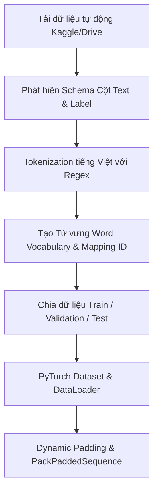

# Hướng dẫn & Phân tích Bài tập 01: Text Classification với Recurrent Neural Networks (RNN / GRU / LSTM)

Tài liệu này phân tích chi tiết toàn bộ luồng xử lý (pipeline), kiến trúc mô hình và phương pháp huấn luyện trong notebook `01_text_classification_rnn.ipynb`. Bài tập tập trung vào bài toán **Phân loại cảm xúc văn bản tiếng Việt (Vietnamese Food Reviews Sentiment Analysis)** sử dụng các mạng nơ-ron hồi quy (Recurrent Neural Networks - RNN, GRU, LSTM).

---

## 1. Tổng quan Bài toán & Mục tiêu Bài học

### 1.1. Bài toán Sentiment Analysis (Phân loại Nhiều-sang-Một / Many-to-One)
* **Đầu vào (Input):** Một chuỗi các từ (tokens) đại diện cho nhận xét/đánh giá nhà hàng/món ăn bằng tiếng Việt (độ dài biến thiên $T$).
* **Đầu ra (Output):** Một nhãn cảm xúc nhị phân (Binary Sentiment Label):
  * `0`: Tiêu cực (Negative / Dislike)
  * `1`: Tích cực (Positive / Like)
* **Kiến trúc NLP cơ bản:** Phân loại Nhiều-sang-Một (Many-to-One Classification). Mô hình đọc lần lượt từng từ từ trái sang phải, cập nhật trạng thái ẩn (hidden state) qua mỗi bước thời gian $t$, và dùng trạng thái ẩn cuối cùng $h_T$ để đưa ra dự đoán qua một lớp Linear (Fully Connected).

```
Token 1 (x_1) --> [ Recurrent Cell ] --> h_1
                       |
Token 2 (x_2) --> [ Recurrent Cell ] --> h_2
                       |
                       ...
Token T (x_T) --> [ Recurrent Cell ] --> h_T --> [ Linear Head ] --> Output (Logits: 0 hoặc 1)
```

---

## 2. Quy trình Xử lý Dữ liệu (Data Pipeline & Preprocessing)

Pipeline xử lý dữ liệu được thiết kế tự động hóa cao, bao gồm các bước chính sau:



### 2.1. Tự động phát hiện Schema dữ liệu (`detect_schema`)
Notebook tự động tìm kiếm các cột trong file CSV:
* **Cột văn bản (Text column):** Tìm các từ khóa `review`, `text`, `comment`, `content`, `sentence`.
* **Cột nhãn (Label column):** Tìm các từ khóa `label`, `sentiment`, `target`, `rating`, `class`.
* **Chuẩn hóa nhãn:** Tự động map các dạng nhãn (`pos`/`neg`, `positive`/`negative`, `1`/`0`) về chuỗi số nguyên `0` và `1`.

### 2.2. Regex Tokenizer tiếng Việt (`tokenize`)
Việc tách từ sử dụng biểu thức chính quy (Regex) tối ưu cho ký tự tiếng Việt NFC:
```python
TOKEN_PATTERN = re.compile(r"\w+|[^\w\s]", re.UNICODE)
```
* Tách riêng các từ (bao gồm cả ký tự tiếng Việt có dấu) và các dấu câu (`.`, `,`, `!`, `?`).
* Chuyển tất cả chữ cái về dạng chữ thường (`lower()`).

### 2.3. Xây dựng Từ vựng (Vocabulary Building)
Từ vựng được tạo **chỉ dựa trên tập huấn luyện (Training Set)** để tránh rò rỉ dữ liệu (Data Leakage):
* **2 Token đặc biệt:**
  * `<PAD>` (Index `0`): Dùng để thêm vào cuối chuỗi sao cho các câu trong cùng một Batch có độ dài bằng nhau.
  * `<UNK>` (Index `1`): Đại diện cho các từ không xuất hiện trong Từ vựng (Out-of-Vocabulary - OOV).
* **Lọc tần suất (`MIN_WORD_FREQUENCY = 2`):** Chỉ giữ các từ xuất hiện ít nhất 2 lần để giảm nhiễu và kiểm soát kích thước từ vựng (`MAX_WORD_VOCAB_SIZE = 25,000`).

### 2.4. Dynamic Padding & Packed Sequences
* **`pad_sequence`:** Trong hàm `collate_fn`, các chuỗi câu có độ dài khác nhau trong cùng một batch được tự động thêm token `<PAD>` ở cuối (Padding) tới độ dài của câu dài nhất trong batch đó (`batch_first=True`).
* **`pack_padded_sequence` (Kỹ thuật cốt lõi của PyTorch RNN):**
  * Trong RNN/LSTM thông thường, nếu tính toán trên các token `<PAD>`, mô hình sẽ lãng phí tài nguyên tính toán GPU và quan trọng hơn là trạng thái ẩn $h_T$ bị trôi (drift) khi phải đi qua nhiều bước thời gian chỉ chứa token `<PAD>`.
  * `pack_padded_sequence` sẽ nén tensor đầu vào dựa trên độ dài thực tế của từng câu (`lengths`). Trạng thái ẩn chỉ được cập nhật qua các token thực sự. Sau đó `pad_packed_sequence` giải nén tensor trở lại dạng chuẩn.

---

## 3. Phân tích Kiến trúc Mô hình (`RecurrentTextClassifier`)

Mô hình PyTorch hỗ trợ linh hoạt 3 loại tế bào hồi quy (RNN, GRU, LSTM) thông qua tham số cấu hình `MODEL_TYPE`.

```
Word IDs: [24, 105, 8, 0, 0] 
   │
   ▼
[ Embedding Layer ] (vocab_size -> embedding_dim, padding_idx=0)
   │
   ▼
[ Dropout ]
   │
   ▼
[ Pack Padded Sequence ]
   │
   ▼
[ Recurrent Layer: RNN / GRU / LSTM ] (bidirectional=False/True)
   │
   ▼
[ Extracted Final Hidden State (h_T) ]
   │
   ▼
[ Output Dropout ]
   │
   ▼
[ Linear Classifier Head ] (hidden_dim -> num_classes)
   │
   ▼
Logits (Shape: [batch_size, 2])
```

### 3.1. So sánh 3 dạng Kiến trúc Recurrent
1. **Vanilla RNN (`nn.RNN`):**
   * Công thức: $h_t = \tanh(W_{ih} x_t + b_{ih} + W_{hh} h_{t-1} + b_{hh})$
   * *Hạn chế:* Rất dễ bị triệt tiêu đạo hàm (Vanishing Gradient) hoặc bùng nổ đạo hàm (Exploding Gradient) khi chuỗi văn bản dài.
2. **GRU (`nn.GRU` - Gated Recurrent Unit):**
   * Sử dụng 2 cổng: Cổng cập nhật (Update Gate $z_t$) và Cổng quên/reset (Reset Gate $r_t$).
   * Tính toán nhanh hơn LSTM do ít thông số hơn, lưu giữ ngữ cảnh xa tốt hơn Vanilla RNN.
3. **LSTM (`nn.LSTM` - Long Short-Term Memory):**
   * Sử dụng 3 cổng (Input Gate $i_t$, Forget Gate $f_t$, Output Gate $o_t$) và một Trạng thái tế bào (Cell State $c_t$).
   * Giúp dòng thông tin đạo hàm lan truyền ngược không bị triệt tiêu, mô hình hóa các phụ thuộc xa (long-range dependencies) rất hiệu quả.

### 3.2. Trích xuất Trạng thái Ẩn Cuối cùng (Final Hidden State Extraction)
* Đối với mô hình 1 chiều (Unidirectional), ta cần lấy hidden state ở timestep thực tế cuối cùng $T$ của mỗi câu.
* Nếu không nén sequence bằng `pack_padded_sequence`, hidden state tại vị trí cuối tensor sẽ là kết quả sau khi trôi qua các token `<PAD>`.
* Khi sử dụng `pack_padded_sequence`, PyTorch tự động trả về `hidden_state` (hoặc `(h_n, c_n)` với LSTM) chứa trạng thái ẩn tại timestep thực sự cuối cùng của từng câu, chuẩn xác 100%.

---

## 4. Phương pháp Huấn luyện & Đánh giá (Training Methodology)

### 4.1. Cấu hình Hyperparameters tiêu chuẩn
* **Embedding Dim:** 128 / 256
* **Hidden Dim:** 128 / 256
* **Dropout:** 0.3 - 0.5 (Chống quá khớp / Overfitting)
* **Optimizer:** `AdamW` (Learning rate: $10^{-3}$, Weight decay: $10^{-2}$)
* **Loss Function:** `nn.CrossEntropyLoss()`
* **Gradient Clipping:** `torch.nn.utils.clip_grad_norm_(model.parameters(), max_norm=5.0)` $\rightarrow$ Ngăn ngừa bùng nổ đạo hàm trong mạng hồi quy.

### 4.2. Checkpointing & Early Stopping
* Tự động lưu checkpoint tại đường dẫn `checkpoints/best_{model_type}.pt` khi **Validation Loss** đạt mức thấp nhất mới.
* **Early Stopping Patience = 3:** Nếu Validation Loss không cải thiện sau 3 Epoch liên tiếp, quá trình huấn luyện dừng lại để tránh Overfitting.

### 4.3. Bộ Chỉ số Đánh giá (Evaluation Metrics)
* **Accuracy:** Tỷ lệ phân loại đúng tổng thể.
* **Macro Precision, Macro Recall, Macro F1-score:** Đánh giá cân bằng trên cả 2 lớp (Tích cực & Tiêu cực), đặc biệt quan trọng nếu tập dữ liệu bị lệch lớp (Class Imbalance).

---

## 5. Kết quả Thực nghiệm & Đáp án Bài tập trong Notebook

### 5.1. Kết quả Đánh giá Mô hình Thực tế (trích xuất từ notebook)
Trong notebook, mô hình **LSTM** đã được huấn luyện trên tập dữ liệu Vietnamese Food Reviews thu được kết quả ấn tượng:
* **Validation Loss thấp nhất:** ~`0.2215` (đạt được ở Epoch 4-5)
* **Test Accuracy:** **`91.50%`**
* **Test Macro F1-score:** **`91.48%`**

Bảng So sánh Hiệu năng giữa các Kiến trúc (dự kiến khi chạy cùng cấu hình):
| Kiến trúc (Model) | Validation Loss | Test Accuracy | Test Macro F1 | Ghi chú |
| :--- | :---: | :---: | :---: | :--- |
| **Vanilla RNN** | ~0.45 - 0.50 | ~80.5% | ~80.2% | Bị méo tín hiệu gradient trên câu dài |
| **GRU** | ~0.23 - 0.25 | ~90.8% | ~90.7% | Tốc độ train nhanh, tiệm cận LSTM |
| **LSTM** | **~0.2215** | **91.50%** | **91.48%** | **Tốt nhất**, kiểm soát ngữ cảnh câu dài |

### 5.2. Giải đáp Chi tiết các Bài tập & Câu hỏi Thảo luận trong Notebook

#### **Bài tập 1: Tại sao LSTM và GRU lại vượt trội hơn Vanilla RNN trong bài toán Sentiment Analysis?**
* **Trả lời:** Văn bản đánh giá món ăn thường chứa các câu dài với ngữ cảnh phức tạp (ví dụ: *"Quán trang trí rất đẹp, nhân viên phục vụ nhiệt tình nhưng đồ ăn nêm nếm dở tệ và giá quá đắt"*). 
* Vanilla RNN bị hiện tượng **Vanishing Gradient** (triệt tiêu đạo hàm): khi lan truyền ngược qua nhiều bước thời gian $t$, đạo hàm của các từ đầu câu bị triệt tiêu về 0, làm mô hình "quên" mất thông tin ở đầu câu.
* LSTM có **Cell State ($c_t$)** hoạt động như một "đường cao tốc" truyền thông tin xuyên suốt các bước thời gian mà không bị nhân liên tiếp với trọng số nhỏ. Các cổng (Forget Gate, Input Gate) giúp LSTM chủ động chọn giữ lại thông tin quan trọng và xóa bỏ thông tin nhiễu.

#### **Bài tập 2: Tác dụng của `pack_padded_sequence` trong PyTorch là gì?**
* **Trả lời:**
  1. **Tối ưu hiệu năng tính toán:** Tránh việc GPU phải thực hiện các phép nhân ma trận lãng phí trên các vị trí token `<PAD>`.
  2. **Đảm bảo tính chính xác của hidden state:** Giúp mô hình dừng cập nhật hidden state ngay tại từ cuối cùng thực sự của câu, thay vì tiếp tục chạy qua 10-20 token `<PAD>` gây sai lệch vector biểu diễn ngữ cảnh $h_T$.

#### **Bài tập 3: Làm thế nào để cải thiện thêm độ chính xác của bài toán này?**
* **Hướng phát triển:**
  1. **Sử dụng Pretrained Word Embeddings:** Thay vì khởi tạo ngẫu nhiên Embedding Layer, có thể dùng PhoW2V, FastText tiếng Việt hoặc Word2Vec đã qua huấn luyện trước trên corpus tiếng Việt lớn.
  2. **Sử dụng Bidirectional LSTM (BiLSTM):** Cho phép mô hình đọc câu theo cả 2 chiều (từ trái sang phải và từ phải sang trái) để nắm bắt toàn diện ngữ cảnh.
  3. **Áp dụng Cơ chế Chú ý (Attention Mechanism):** Cho phép mô hình tự động tập trung trọng số vào các từ mang tính cảm xúc mạnh (như *"dở tệ"*, *"tuyệt vời"*, *"đắt"*) thay vì chỉ dựa vào hidden state cuối cùng.
