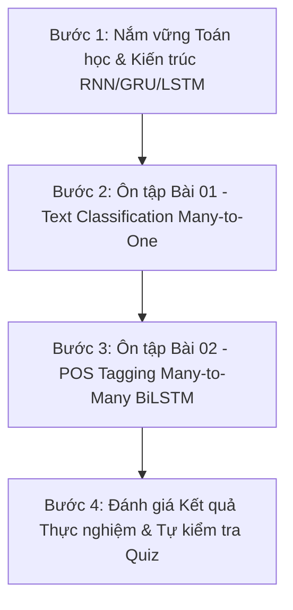

# Lộ trình Ôn tập & Thực hành Buổi 02: Recurrent Neural Networks (RNN) & Các Bài toán NLP Cơ bản

Tài liệu này hệ thống hóa toàn bộ kiến thức lý thuyết, ma trận ánh xạ mã nguồn và lộ trình các bước ôn tập cho **Buổi 02 - Mạng nơ-ron Hồi quy & Các bài toán NLP cơ bản** trong chương trình OlpAI 2026.

---

## 1. Hệ thống hóa Kiến thức Lý thuyết Cốt lõi

### 1.1. Mạng Nơ-ron Hồi quy (Vanilla RNN)
* **Bản chất:** Mô hình xử lý dữ liệu dạng chuỗi (Sequence Data) bằng cách duy trì trạng thái ẩn (Hidden State $a^{\langle t \rangle}$) qua từng bước thời gian $t$.
* **Đầu vào / Đầu ra tại bước $t$:**
  * Đầu vào $x^{\langle t \rangle}$: Vector nhúng (Embedding Vector) đại diện cho token thứ $t$.
  * Trạng thái ẩn khởi tạo $a^{\langle 0 \rangle}$: Thường khởi tạo bằng vector $\vec{0}$.
  * Công thức cập nhật: $a^{\langle t \rangle} = \tanh(W_{aa} a^{\langle t-1 \rangle} + W_{ax} x^{\langle t \rangle} + b_a)$
* **Ưu điểm lớn nhất:** Bộ trọng số $W$ được chia sẻ chung (parameter sharing) trên toàn bộ chuỗi thời gian, giúp số lượng tham số độc lập hoàn toàn với độ dài văn bản.
* **Nhược điểm & Thách thức:**
  * **Gradient Vanishing (Tiêu biến gradient):** Khi chuỗi dài, đạo hàm lan truyền ngược giảm theo cấp số nhân $\to$ Mô hình "quên" thông tin ở xa (Long-term dependencies).
  * **Gradient Explosion (Bùng nổ gradient):** Gradient phình to đột ngột $\to$ Gây lỗi giá trị `NaN`. Cần khắc phục bằng kỹ thuật **Gradient Clipping** (`clip_grad_norm_`).

---

### 1.2. Các Biến thể Khắc phục Nhược điểm: GRU & LSTM

| Tiêu chí | Vanilla RNN | Gated Recurrent Unit (GRU) | Long Short-Term Memory (LSTM) |
| :--- | :---: | :---: | :---: |
| **Cấu trúc tế bào** | Đơn giản | Trung bình | Phức tạp |
| **Số cổng (Gates)** | **0** | **2** (Reset $\Gamma_r$, Update $\Gamma_u$) | **3** (Forget $\Gamma_f$, Update $\Gamma_u$, Output $\Gamma_o$) |
| **Trạng thái (States)** | 1 ($a^{\langle t \rangle}$) | 1 ($a^{\langle t \rangle}$) | **2** ($a^{\langle t \rangle}$ và Cell State $c^{\langle t \rangle}$) |
| **Khả năng nhớ xa** | Kém | Tốt | **Rất tốt** |
| **Tốc độ & Tham số** | Nhanh nhất, ít tham số | Nhanh hơn LSTM, tham số vừa | Nhiều tham số nhất, huấn luyện lâu nhất |

* **GRU:** Sử dụng Cell State tạm thời $\tilde{c}^{\langle t \rangle}$ kết hợp Cổng Reset $\Gamma_r$ và Cổng Cập nhật $\Gamma_u$ để cân bằng giữa bộ nhớ cũ và thông tin mới.
* **LSTM:** Sử dụng **Cell State $c^{\langle t \rangle}$** làm "đường cao tốc" truyền bộ nhớ dài hạn không bị triệt tiêu gradient. Cổng Forget $\Gamma_f$ quyết định xóa bớt thông tin cũ, Cổng Update $\Gamma_u$ ghi thông tin mới, và Cổng Output $\Gamma_o$ trích xuất thông tin ra Hidden State $a^{\langle t \rangle}$.

---

### 1.3. Mạng Hồi quy Hai chiều (Bidirectional RNN - BiRNN)
* **Nguyên lý:** Kết hợp 2 lớp RNN chạy song song:
  * **Forward Layer ($\vec{a}^{\langle t \rangle}$):** Đọc chuỗi từ trái qua phải ($x_1 \to x_T$), nắm bắt ngữ cảnh quá khứ.
  * **Backward Layer ($\overleftarrow{a}^{\langle t \rangle}$):** Đọc chuỗi từ phải qua trái ($x_T \to x_1$), nắm bắt ngữ cảnh tương lai.
  * **Trạng thái hợp nhất:** $a^{\langle t \rangle} = [\vec{a}^{\langle t \rangle} ; \overleftarrow{a}^{\langle t \rangle}]$ có kích thước `hidden_dim * 2`.
* **Tầm quan trọng:** Trong NLP, ngữ nghĩa của một từ phụ thuộc rất lớn vào cả từ đứng trước lẫn từ đứng sau. BiRNN cung cấp góc nhìn toàn diện 360 độ cho bài toán.

---

### 1.4. Phân loại 4 Kiến trúc NLP Phổ biến

```
1. One-to-Many:   Input [X] ───────────────> Output [y_1, y_2, ..., y_T]
   (Ứng dụng: Image Captioning, Text-to-Speech, Music Generation)

2. Many-to-One:    Input [x_1, x_2, ..., x_T] ─> Output [Y]
   (Ứng dụng: Sentiment Analysis, Spam Detection, Topic Classification)

3. Many-to-Many (Tx = Ty): Input [x_1, ..., x_T] ─> Output [y_1, ..., y_T]
   (Ứng dụng: POS Tagging, Named Entity Recognition - NER)

4. Seq2Seq (Tx != Ty):      Input [x_1, ..., x_Tx] ─[Encoder]─> Context ─[Decoder]─> Output [y_1, ..., y_Ty]
   (Ứng dụng: Machine Translation, Text Summarization)
```

---

## 2. Ma trận Ánh xạ Bài tập thực hành & File Code Hiện có

Hệ thống đã chuẩn bị sẵn **2 Notebook thực hành chuẩn mực** kèm **2 Tài liệu phân tích chuyên sâu**:

```
GiaiDoan1_Tabular_Data/
├── 01_text_classification_rnn.ipynb  <--> 01_text_classification_rnn.md (Text Classification)
└── 02_pos_tagging_bilstm.ipynb        <--> 02_pos_tagging_bilstm.md       (POS Tagging)
```

### 2.1. Bài tập 1: Phân loại Cảm xúc Văn bản (Text Classification / Many-to-One)
* **File Code:** `01_text_classification_rnn.ipynb`
* **Tài liệu Giải thích:** `01_text_classification_rnn.md`
* **Dữ liệu:** Vietnamese Food Reviews (Kaggle).
* **Mục tiêu:** Phân loại đánh giá món ăn thành 2 nhãn: Tích cực (`1`) hoặc Tiêu cực (`0`).
* **Các kỹ thuật cốt lõi đã triển khai trong code:**
  1. Regex Tokenizer tiếng Việt tối ưu ký tự có dấu NFC.
  2. Từ vựng chỉ xây trên tập Train để chống rò rỉ dữ liệu (Data Leakage).
  3. Dynamic Padding với token `<PAD>` (Index `0`).
  4. Sử dụng **`pack_padded_sequence`** của PyTorch để nén chuỗi, tránh trôi hidden state qua token `<PAD>` và tăng tốc độ tính toán GPU.
  5. So sánh thực nghiệm giữa 3 mô hình Vanilla RNN, GRU và LSTM.

### 2.2. Bài tập 2: Gắn nhãn Từ loại (POS Tagging / Many-to-Many $T_x = T_y$)
* **File Code:** `02_pos_tagging_bilstm.ipynb`
* **Tài liệu Giải thích:** `02_pos_tagging_bilstm.md`
* **Dữ liệu:** Kaggle NER Dataset (42 nhãn POS ngữ pháp).
* **Mục tiêu:** Dự đoán nhãn POS tại từng từ cho chuỗi câu.
* **Các kỹ thuật cốt lõi đã triển khai trong code:**
  1. Gom nhóm dữ liệu theo CÂU HOÀN CHỈNH (`sentence_id`) sử dụng `groupby`.
  2. Phân chia tập Train / Val / Test trên cấp độ CÂU để tránh token của cùng câu nằm ở 2 tập khác nhau.
  3. Dynamic Padding đồng thời cho cả Word Tensor và POS Target Tensor (`pad_batch`).
  4. Loss function sử dụng `nn.CrossEntropyLoss(ignore_index=0)` để triệt tiêu ảnh hưởng của token `<PAD>`.
  5. Loại trừ token `<PAD>` khi tính Macro F1 và Token Accuracy (`flatten_without_padding`).
  6. So sánh đối đầu giữa **Unidirectional LSTM** vs **Bidirectional LSTM (BiLSTM)**.

---

## 3. Lộ trình Ôn tập 4 Bước Từng bước (Step-by-Step Study Plan)



### Bước 1: Ôn tập Lý thuyết & Phép toán Cổng (30 phút)
* Học thuộc công thức tính toán và số lượng cổng của RNN (0 cổng), GRU (2 cổng: Reset, Update), LSTM (3 cổng: Forget, Update, Output + Cell state).
* Hiểu rõ hiện tượng Vanishing Gradient và lý do Cell State $c^{\langle t \rangle}$ giúp LSTM truyền tín hiệu đi xa.

### Bước 2: Thực hành & Chạy lại Notebook `01_text_classification_rnn.ipynb` (45 phút)
* Đọc tài liệu `01_text_classification_rnn.md` trước để nắm toàn bộ sơ đồ pipeline.
* Mở notebook, chạy qua các Cell tiền xử lý dữ liệu và quan sát cách `pack_padded_sequence` nén tensor.
* Thay đổi tham số `MODEL_TYPE` giữa `'RNN'`, `'GRU'`, và `'LSTM'` để tự kiểm chứng sự chênh lệch độ chính xác (LSTM đạt ~91.5% Accuracy).

### Bước 3: Thực hành & Chạy lại Notebook `02_pos_tagging_bilstm.ipynb` (45 phút)
* Đọc tài liệu `02_pos_tagging_bilstm.md` để hiểu sự khác biệt giữa Many-to-One và Many-to-Many.
* Kiểm tra hàm `pad_batch` và `flatten_without_padding` để hiểu cơ chế tính loss/metric loại trừ `<PAD>`.
* Chạy so sánh mô hình `LSTM` 1 chiều (Macro F1 ~87.22%) vs `BiLSTM` (Macro F1 ~92.49%) để thấy tầm quan trọng của ngữ cảnh 2 chiều.

### Bước 4: Tự kiểm tra & Mở rộng (30 phút)
* Tự trả lời 6 câu hỏi ôn tập trong Section 4 bên dưới.

---

## 4. Câu hỏi Ôn tập & Bài tập Tự Đánh giá (Self-Assessment Quiz)

1. **Câu 1:** Tại sao số lượng tham số của mạng RNN không thay đổi khi độ dài câu tăng từ 10 từ lên 100 từ?
   * *Gợi ý:* Nhờ cơ chế chia sẻ trọng số (Parameter Sharing) dùng chung bộ ma trận $W_{ax}, W_{aa}, W_{ya}$ cho mọi timestep.
2. **Câu 2:** Gradient Vanishing xảy ra khi nào và tại sao LSTM lại giải quyết được vấn đề này?
   * *Gợi ý:* Xảy ra khi đạo hàm lan truyền ngược nhỏ hơn 1 được nhân liên tiếp qua nhiều bước thời gian. LSTM có Cell State $c^{\langle t \rangle}$ với các phép cộng tuyến tính giúp đạo hàm truyền trực tiếp không bị giảm triệt tiêu.
3. **Câu 3:** Tác dụng của `pack_padded_sequence` trong PyTorch là gì?
   * *Gợi ý:* Nén tensor để bỏ qua tính toán trên token `<PAD>`, giúp tăng tốc GPU và ngăn trạng thái ẩn bị trôi khi qua các token đệm.
4. **Câu 4:** Tại sao BiLSTM lại vượt trội hơn Unidirectional LSTM trong bài toán POS Tagging?
   * *Gợi ý:* POS tag của 1 từ phụ thuộc vào cả từ đứng trước (quá khứ) và từ đứng sau (tương lai). BiLSTM kết hợp cả Forward và Backward LSTM để nắm ngữ cảnh 360 độ.
5. **Câu 5:** Tại sao phải dùng Macro F1 bên cạnh Token Accuracy cho bài toán POS Tagging?
   * *Gợi ý:* Do hiện tượng Class Imbalance (lệch nhãn). Token Accuracy chỉ phản ánh các nhãn phổ biến (`NN`, `IN`), trong khi Macro F1 tính trung bình từng nhãn độc lập, phản ánh khả năng nhận diện các từ loại hiếm.
6. **Câu 6:** Làm thế nào để loại bỏ ảnh hưởng của token `<PAD>` khi tính CrossEntropyLoss trong PyTorch?
   * *Gợi ý:* Truyền tham số `ignore_index=0` (với 0 là ID của `<PAD>`) vào `nn.CrossEntropyLoss`.
